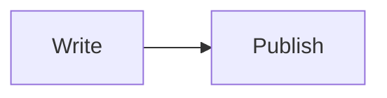

# mono-press (MonoPress)


[](https://github.com/kgyujin/mono-press)
[](https://react.dev/)
[](https://www.markdownguide.org/)
[](https://vercel.com/)

> A local-first Markdown publisher for clean HTML and monochrome PDF documents.

`mono-press`는 Markdown 파일 하나만 업로드하는 대신 문서와 이미지·Mermaid 파일이 들어 있는 **상위 폴더를 작업 공간으로 불러오는 변환 사이트**입니다. 상대 경로를 자동으로 연결하고, 흑백 문서 시스템으로 렌더링한 뒤 HTML과 PDF로 내보냅니다.

## Features

- 단일 Markdown 파일 또는 문서 폴더 선택 및 드래그 앤 드롭
- Markdown, GFM 표, 코드 블록, 인용문 렌더링
- 이미지 상대 경로 자동 해석 및 누락 자산 표시
- Mermaid 다이어그램 전용 모노크롬 테마
- 단일 HTML 파일 내보내기 — 이미지 data URL 포함
- A4 인쇄 레이아웃을 사용하는 PDF 내보내기
- 문서 원본을 서버에 업로드하지 않는 로컬 우선 처리
- 반응형 Split / Preview 작업 화면

## Quick start

```bash
npm install
npm run dev
```

브라우저에서 표시된 로컬 주소를 열고 `Open file`로 Markdown 파일 하나를 빠르게 열거나, `Open folder`로 이미지와 다이어그램이 포함된 상위 폴더를 선택합니다.

단일 파일을 열면 문서 자체를 바로 편집할 수 있습니다. 문서에 연결된 로컬 이미지와 다이어그램까지 함께 해석하려면 해당 파일이 들어 있는 상위 폴더를 선택하세요.

## Supported workspace

```text
your-docs/
├── README.md
├── images/
│   ├── architecture.png
│   └── result.webp
└── diagrams/
    └── flow.mmd
```

Markdown에서 사용하는 상대 경로는 현재 문서 위치를 기준으로 해석됩니다.

```md

```

Mermaid fenced code block은 mono-press의 일관된 흑백 스타일로 렌더링됩니다.

````md

````

## Scripts

| Command | Purpose |
| --- | --- |
| `npm run dev` | Start the local development server |
| `npm run lint` | Check the project with ESLint |
| `npm run build` | Create a Vercel-compatible Next.js production build |

## Vercel deployment

프로젝트는 표준 Next/React 앱 구조를 사용하므로 Vercel에 연결해 배포할 수 있습니다.

1. GitHub 저장소를 Vercel 프로젝트에 연결합니다.
2. Framework Preset은 Next.js를 사용합니다.
3. Build Command는 `npm run build`를 사용합니다.
4. Output Directory는 비워 두어 Next.js 기본 출력 디렉터리(`.next`)를 사용합니다.
5. 별도 환경변수 없이 로컬 파일 처리 기능을 사용할 수 있습니다.

문서 파일은 브라우저에서 선택한 뒤 기기 안에서만 처리됩니다. 서버 저장 기능이나 인증을 추가할 때는 이 로컬 우선 원칙을 별도로 검토해야 합니다.

## Project structure

```text
app/              UI, metadata, global styles
lib/workspace.ts  Folder normalization and relative-path resolution
lib/markdown.ts   Markdown, image, and Mermaid rendering
lib/export.ts     Standalone HTML export and asset inlining
public/            favicon and mono-press SVG mark
```

## License

개인 프로젝트용 베타 버전입니다. 배포 전 라이선스 정책을 확정하세요.
