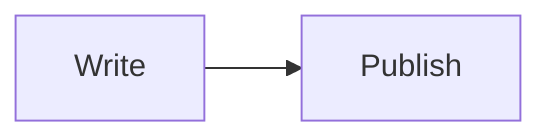

# mono-press (MonoPress)


[](https://github.com/kgyujin/mono-press)
[](https://react.dev/)
[](https://www.markdownguide.org/)
[](https://vercel.com/)

> A local-first Markdown publisher for clean HTML and monochrome PDF documents.

## Brand mark

mono-press의 공식 로고는 `M` 형태의 접힌 문서와 아래의 press line으로 구성합니다.


- `M`: mono와 Markdown의 첫 글자이자, 두 페이지 면이 한 문서로 접히는 형태
- 중앙 접힘: Markdown 구조가 읽기 쉬운 문서로 정리되는 과정
- 아래 수평선: press의 기준선, 즉 인쇄·출판 가능한 결과물

사이트 헤더와 로고는 심볼과 `mono-press` 워드마크를 함께 사용하고, favicon과 작은 UI에서는 같은 심볼만 사용합니다. 따라서 크기가 달라도 하나의 브랜드 언어로 인식됩니다.

`mono-press`는 Markdown 파일 하나만 업로드하는 대신 문서와 이미지·Mermaid 파일이 들어 있는 **상위 폴더를 작업 공간으로 불러오는 변환 사이트**입니다. 상대 경로를 자동으로 연결하고, 흑백 문서 시스템으로 렌더링한 뒤 HTML과 PDF로 내보냅니다.

## Features

- 단일 Markdown 파일 또는 문서 폴더 선택 및 드래그 앤 드롭
- Markdown, GFM 표, 코드 블록, 인용문 렌더링
- 언어 지정 코드 블록 문법 강조 — JavaScript/TypeScript, Python, Shell, JSON, HTML/CSS, SQL 등
- 이미지 상대 경로 자동 해석 및 누락 자산 표시
- Mermaid 다이어그램 전용 모노크롬 테마
- 단일 HTML 파일 내보내기 — 이미지 data URL 포함
- 인쇄 안전 코드 블록, 문서 헤더·푸터, 페이지 번호를 포함한 A4 PDF 출력
- 문서 원본을 서버에 업로드하지 않는 로컬 우선 처리
- 반응형 Split / Preview 작업 화면

## Quick start

```bash
npm install
npm run dev
```

브라우저에서 표시된 로컬 주소를 열고 `Open file`로 Markdown 파일 하나를 빠르게 열거나, `Open folder`로 이미지와 다이어그램이 포함된 상위 폴더를 선택합니다.

단일 파일을 열면 문서 자체를 바로 편집할 수 있습니다. 문서에 연결된 로컬 이미지와 다이어그램까지 함께 해석하려면 해당 파일이 들어 있는 상위 폴더를 선택하세요.

## Supported workspace

```text
your-docs/
├── README.md
├── images/
│   ├── architecture.png
│   └── result.webp
└── diagrams/
    └── flow.mmd
```

Markdown에서 사용하는 상대 경로는 현재 문서 위치를 기준으로 해석됩니다.

```md

```

Mermaid fenced code block은 mono-press의 일관된 흑백 스타일로 렌더링됩니다.

````md

```mermaid
flowchart LR
  A[Write] --> B[Publish]
```
````

## Scripts

| Command | Purpose |
| --- | --- |
| `npm run dev` | Start the local development server |
| `npm run lint` | Check the project with ESLint |
| `npm run build` | Create a Vercel-compatible Next.js production build |

### Print regression test

`npm test`는 단위 테스트와 실제 Chrome 브라우저 회귀 테스트를 모두 실행합니다. 실행 환경에는 Google Chrome과 Poppler(`pdftotext`)가 필요합니다. Playwright는 개발 의존성으로 설치됩니다.

```bash
npm ci
npm test
npm run test:unit     # 단위 테스트만 실행
npm run test:browser  # 편집/복원/내보내기 및 PDF 인쇄 검사
```

인쇄 검사 PDF는 시스템 임시 폴더에 저장되며 `PRINT_QA_DIR`로 위치를 지정할 수 있습니다. 앱/HTML 출력 각각에서 긴 순서도, 넓은 순서도, 페이지 경계, 작은 순서도를 확인합니다. 편집기 검사는 로컬 포트 3187을 사용합니다.

## Local drafts

편집 내용과 연결된 파일은 현재 브라우저의 IndexedDB에 자동 저장됩니다. 같은 작업 공간에서 문서를 전환하거나 새로고침하면 복원됩니다. 원본 파일은 변경하지 않습니다. 새 파일/폴더를 열면 저장된 작업 공간이 교체됩니다.

저장 완료 여부는 편집기 아래에 표시합니다. 브라우저가 저장을 차단하거나 용량이 부족하면 실패 메시지를 표시하며, 저장이 끝나지 않은 상태에서 창을 닫으려 하면 경고합니다. 브라우저 데이터 삭제 또는 시크릿 창 종료 후에는 복원할 수 없으므로 필요한 문서는 별도로 내보내세요.

HTML/PDF 내보내기는 Mermaid 렌더링 완료를 기다립니다. 순서도 문법 오류가 있거나 대기 중 문서가 바뀌면 내보내기를 중단하고 안내합니다.

## PDF output

`PDF` 버튼은 브라우저의 인쇄 대화상자를 열고, 문서 본문만 A4 인쇄 레이아웃으로 표시합니다. 대화상자에서 대상 프린터를 `Save as PDF`로 선택하고 배율은 100%로 두면 됩니다. mono-press가 문서 제목, 파일명, 페이지 번호를 인쇄용 헤더·푸터로 추가하므로 브라우저의 `Headers and footers` 옵션은 끄는 것을 권장합니다.

코드 블록은 배경 그래픽 설정에 의존하지 않도록 흰색 바탕과 검은색 글자로 출력됩니다. 로컬 이미지와 Mermaid 다이어그램까지 포함하려면 단일 Markdown 파일이 아니라 해당 파일이 들어 있는 상위 폴더를 먼저 선택하세요.

Mermaid 순서도는 인쇄할 때 비율을 유지하며 최대 높이 220mm로 축소하여 A4 한 페이지 안에 배치합니다. 현재 페이지에 공간이 부족하면 다음 페이지로 이동하며, 매우 긴 순서도는 글자가 작아질 수 있습니다. 이 규칙은 PDF 출력과 내보낸 HTML 인쇄에 동일하게 적용됩니다.

문서 헤더·푸터와 페이지 번호는 Chromium 계열 브라우저에서 가장 안정적으로 표시됩니다.

## Vercel deployment

프로젝트는 표준 Next/React 앱 구조를 사용하므로 Vercel에 연결해 배포할 수 있습니다.

1. GitHub 저장소를 Vercel 프로젝트에 연결합니다.
2. Framework Preset은 Next.js를 사용합니다.
3. Build Command는 `npm run build`를 사용합니다.
4. Output Directory는 비워 두어 Next.js 기본 출력 디렉터리(`.next`)를 사용합니다.
5. 별도 환경변수 없이 로컬 파일 처리 기능을 사용할 수 있습니다.

문서 파일은 브라우저에서 선택한 뒤 기기 안에서만 처리됩니다. 서버 저장 기능이나 인증을 추가할 때는 이 로컬 우선 원칙을 별도로 검토해야 합니다.

## Project structure

```text
app/              UI, metadata, global styles
lib/workspace.ts  Folder normalization and relative-path resolution
lib/markdown.ts   Markdown, image, and Mermaid rendering
lib/export.ts     Standalone HTML export and asset inlining
public/            favicon and mono-press SVG mark
```

## License

개인 프로젝트용 베타 버전입니다. 배포 전 라이선스 정책을 확정하세요.
